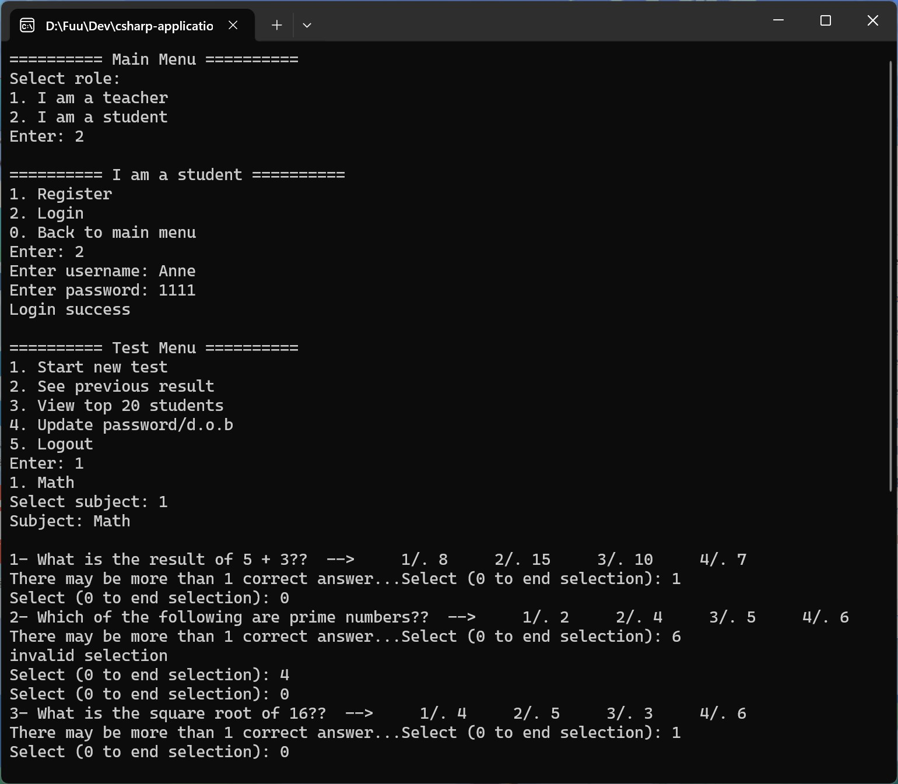
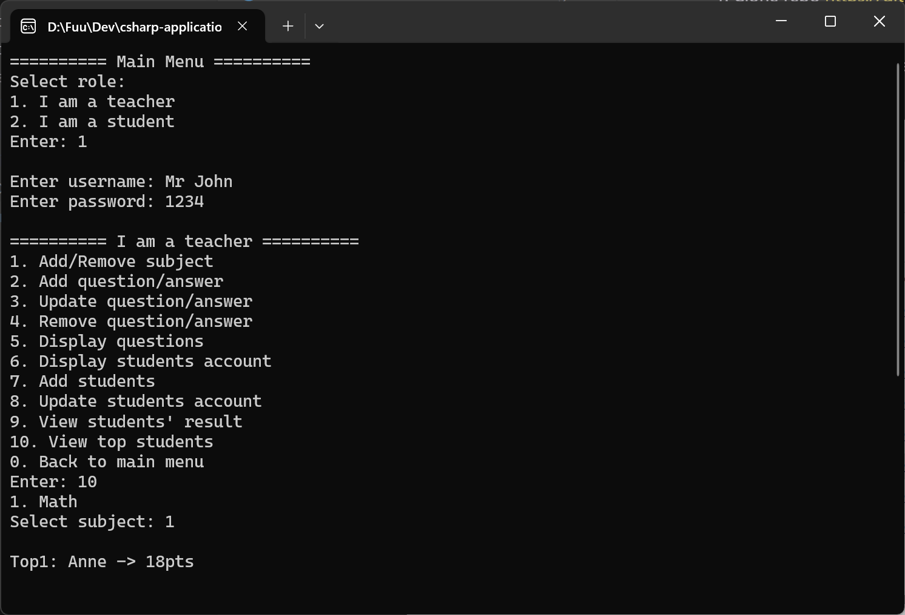

# Student Exam Management System

A C# console application for teacher managing student test questions and results, and allowing students to take test and keep track of their scores.

## Features

Teacher Functionality

- Authentication system
- Subject management
- Question and answer management
- Student information management
- Test result tracking
- Top student tracking

Student Functionality

- Registration
- Login
- Take tests
- View personal test results
- Update personal account
- View student ranking

## How to Run

1. Clone rep https://github.com/Meimei07/csharp-application-quiz.git

2. Run executable in the following path "csharp-application-quiz\Practice-exam2\bin\Debug\Practice-exam2.exe"

### use existing accounts to log in

Teacher account - `Mr John` - `1234`

Student account - `Anne` - `1111`

## Demo

Student login and test taking demonstration

Teacher login and tracking student result demonstration

